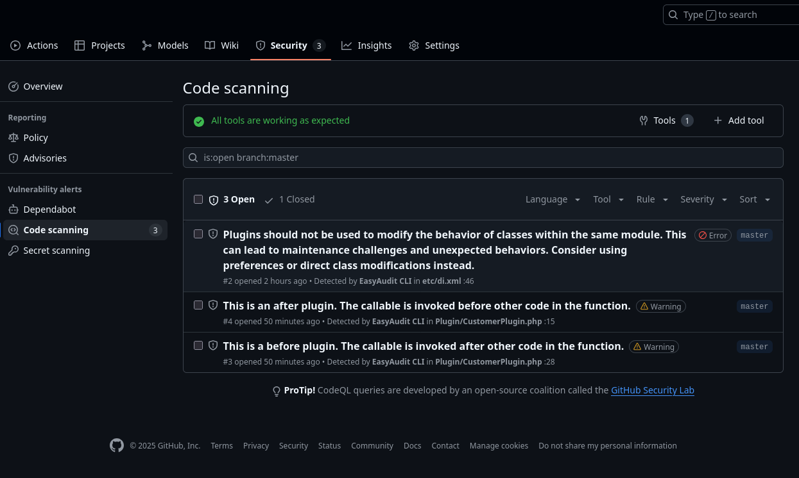

# EasyAudit

[](https://github.com/crealoz/easyaudit-cli/releases)
[](./LICENSE)
[](https://php.net)
[](https://github.com/crealoz/easyaudit-cli/actions)
[](https://codecov.io/gh/crealoz/easyaudit-cli)

Static analysis tool for Magento 2 codebases. Detects anti-patterns, security risks, and architectural issues.

## Features

- **19 processors** for DI, code quality, templates, performance, and architecture
- **Zero dependencies** - standalone PHAR (~455KB)
- **CI/CD ready** - SARIF output for GitHub Code Scanning
- **Docker image** available
- **Auto-fix** - Automatic patch generation via API

## Quick Start

### Using PHAR
```bash
# Download latest PHAR
curl -LO https://github.com/crealoz/easyaudit-cli/releases/latest/download/easyaudit.phar
chmod +x easyaudit.phar

# Run
php easyaudit.phar scan /path/to/magento --format=sarif
```

### Using Docker
```bash
docker run --rm -v $PWD:/workspace ghcr.io/crealoz/easyaudit:latest \
  scan /workspace --format=sarif --output=/workspace/report/easyaudit.sarif
```

### From Source
```bash
git clone git@github.com:crealoz/easyaudit-cli.git
php bin/easyaudit scan /path/to/magento
```

## Output Formats

| Format  | Use Case                          |
|---------|-----------------------------------|
| `json`  | Tooling and scripting (default)   |
| `sarif` | GitHub Code Scanning              |
| `html`  | Visual report, shareable via browser or PDF |

Console output is always displayed during scan.

## GitHub Actions

### Scan & upload to Code Scanning

```yaml
name: EasyAudit Scan

on: [push, pull_request]

permissions:
  contents: read
  security-events: write

jobs:
  scan:
    runs-on: ubuntu-latest
    container:
      image: ghcr.io/crealoz/easyaudit:latest
    steps:
      - uses: actions/checkout@v6
      - run: |
          mkdir -p report
          easyaudit scan --format=sarif --output=report/easyaudit.sarif \
            --exclude="vendor,generated,var,pub/static,pub/media" "$GITHUB_WORKSPACE"
      - uses: github/codeql-action/upload-sarif@v4
        with:
          sarif_file: report/easyaudit.sarif
```

> **Private repos**: SARIF upload requires [GitHub Advanced Security](https://docs.github.com/en/get-started/learning-about-github/about-github-advanced-security), which is a paid feature for private repositories. Use `--format=json` or `--format=html` with `upload-artifact` instead. See [GitHub Actions docs](docs/ci-cd/github-actions.md#private-repositories) for alternative workflows.



### Scan, fix & create PR (paid)

One-click workflow: scan, call the paid API for fixes, and open a PR with the patches. Requires `EASYAUDIT_AUTH` secret.

See [Automated PR docs](docs/request-pr.md) for the full workflow file and setup instructions.

## Documentation

- [CLI Usage](docs/cli-usage.md) - Commands, options, examples
- [Available Processors](docs/processors.md) - All 19 analysis rules
- [CI/CD Integration](docs/ci-cd.md) - GitHub, GitLab, Bitbucket, Azure, CircleCI, Jenkins, Travis
- [Automated PR (paid)](docs/request-pr.md) - Auto-fix via API
- Developer Guide: [Writing Processors](docs/developer-guide/processors.md) | [Utilities Reference](docs/developer-guide/utilities.md)

## Requirements

- PHP 8.1+
- Docker (optional)

## License

MIT

