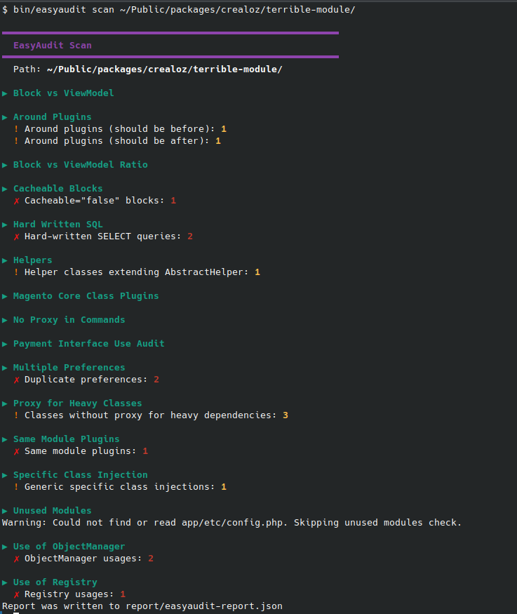
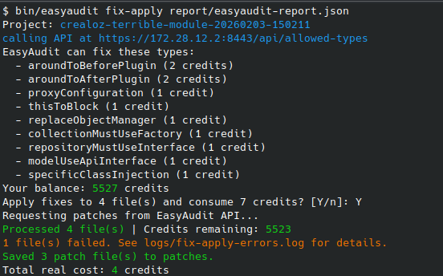

# CLI Usage

## Installation

### Clone the repository
```bash
git clone git@github.com:crealoz/easyaudit-cli.git
cd easyaudit-cli
```

### Using PHAR (recommended)

```bash
# Download latest PHAR
curl -LO https://github.com/crealoz/easyaudit-cli/releases/latest/download/easyaudit.phar
chmod +x easyaudit.phar

# Optional: move to PATH
sudo mv easyaudit.phar /usr/local/bin/easyaudit
```

### Using Docker
```bash
docker pull ghcr.io/crealoz/easyaudit:latest
```

---

## Commands

### Scan

Run static analysis on a Magento codebase.

```bash
# Basic scan (JSON output, default)
php bin/easyaudit scan /path/to/magento

# Explicit JSON output
php bin/easyaudit scan /path/to/magento --format=json

# SARIF output (for GitHub Code Scanning)
php bin/easyaudit scan /path/to/magento --format=sarif

# HTML report (visual dashboard, print-to-PDF friendly)
php bin/easyaudit scan /path/to/magento --format=html

# Custom output file
php bin/easyaudit scan /path/to/magento --format=sarif --output=report/scan.sarif

# Exclude directories
php bin/easyaudit scan /path/to/magento --exclude="vendor,generated,var"

# Exclude file extensions
php bin/easyaudit scan /path/to/magento --exclude-ext="js,css"
```

### Options

| Option | Description | Default |
|--------|-------------|---------|
| `--format` | Output format: `json`, `sarif`, `html` | `json` |
| `--output` | Output file path | `report/easyaudit-report.(json\|sarif\|html)` |
| `--exclude` | Comma-separated directories to exclude | none |
| `--exclude-ext` | Comma-separated file extensions to exclude | none |

### Help

```bash
php bin/easyaudit scan --help
```

---

## Common Use Cases

### Scan app/code only
```bash
php bin/easyaudit scan /path/to/magento/app/code --format=json
```

### Scan a single module
```bash
php bin/easyaudit scan /path/to/magento/app/code/Vendor/Module --format=json
```

### Scan with all exclusions (production-like)
```bash
php bin/easyaudit scan /path/to/magento \
  --exclude="vendor,generated,var,pub/static,pub/media,dev,setup" \
  --format=sarif \
  --output=report/easyaudit.sarif
```

### Quick check before commit
```bash
php bin/easyaudit scan . --format=json
```

### Scan and fix workflow
```bash
# 1. Scan and generate report
php bin/easyaudit scan /path/to/magento --format=json --output=report.json

# 2. Apply fixes (requires API credits)
php bin/easyaudit fix-apply report.json
```

Automated PR creation is available as a paid feature. See [Automated PR workflow](request-pr.md) for CI/CD integration.

---

## Docker Usage

### Basic scan
```bash
docker run --rm -v $PWD:/workspace ghcr.io/crealoz/easyaudit:latest \
  scan /workspace --format=json
```

### Generate SARIF report
```bash
docker run --rm -v $PWD:/workspace ghcr.io/crealoz/easyaudit:latest \
  scan /workspace \
  --format=sarif \
  --output=/workspace/report/easyaudit.sarif
```

### Scan with exclusions
```bash
docker run --rm -v $PWD:/workspace ghcr.io/crealoz/easyaudit:latest \
  scan /workspace \
  --exclude="vendor,generated,var,pub/static,pub/media" \
  --format=json
```

---

## Exit Codes

| Code | Meaning |
|------|---------|
| `0` | No errors or warnings found |
| `1` | Warnings found |
| `2` | Errors found |

Use exit codes in CI to fail builds:

```bash
php bin/easyaudit scan /path/to/magento --format=sarif || exit 1
```

---

## Output Examples



> **💡 Auto-fix available**
> Many issues can be fixed automatically. Run `easyaudit fix-apply` or [set up automated PRs →](request-pr.md)

 

### JSON
```json
[
  {
    "ruleId": "sameModulePlugins",
    "message": "Plugin on same module class",
    "files": [
      {
        "file": "app/code/Vendor/Module/Plugin/SomePlugin.php",
        "line": 15
      }
    ]
  }
]
```

### HTML

The HTML format produces a self-contained dashboard with:

- **Summary cards** — color-coded counts for errors, warnings, and notes
- **Collapsible rule sections** — one per processor, with a table of affected files, line numbers, and messages
- **Print-to-PDF support** — `@media print` styles ensure clean output when printing from the browser

```bash
# Generate HTML report
php bin/easyaudit scan /path/to/magento --format=html

# Open in browser
xdg-open report/easyaudit-report.html    # Linux
open report/easyaudit-report.html         # macOS
```

The report is fully standalone (all CSS inline, no external dependencies) and can be shared as a single file or printed to PDF directly from the browser.


---

[Back to README](../README.md)